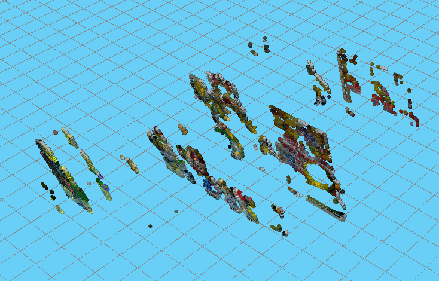

## Introduction

In this Blog, I **Omar Garrido Martin**, student of the Master in Computer Vision from the university URJC, Madrid, Spain, will describe all the steps Ive gone through to reconstruct a 3d scene from a stereo pair of cameras in the [JdeRobot Academy Simulator](https://unibotics.org/main_page)

This is part of an exercise for the subject Robotic Vision. Here the setup of the simulator can be seen:

The goal of the exercise is to reconstruct the scene seen by the pair of cameras in 3d with the best possible accuracy. Also as a second criteria the speed of reconstruction is taking into account.

## 1. Introduction to the problem and the environment

There are two cameras, one left and one right on the same plane. This cameras form a caconical stereo configuration. This means that both cameras are in the same plane with the same orientation and has some advantages over a normal stereo configuration that will be discussed later. Even the stereo configuration is canonical this exercise will be solved using the methods that you will generally used in a stereo configuration 3d reconstruction, no advantage of the canonical configuration will be used. So the techniques used could be used for any stereo pair.

The two cameras are calibrated, we have both the intrinsec and the extrinsics parameters:

With the intrinsic matrix and the extrinsic matrix the Projection matrix can be created (Mint x Mext).

This projection matrix allows to pass from a 3d point in the world coordinates to a 2d point in the image. But not in the inverse way 2d -> 3d. This is due to the linear system having more variables than equation. (Passing from 2D point to a 3D point, three variables but only two equations). To solve this problem and be able to reconstruct on 3D we need two cameras to add more equations to be able to solve the system.

By looking at the extrinsic parameters for each camera, it can be seen that the world coordinates is in the middle of the two cameras, one is 110 mm to the left and the other 110 mm to the right.

But since the simulator environment counts with some methods to project and reproject, the camera intrinsic and extrinsic parameters from the camera are not needed, since this methods will take care of all the calculus.

The methods are:

- **self.camLeftP.graficToOptical(point2d)** 
- **self.camLeftP.backproject(point2d)**
- **self.camLeftP.opticalToGrafic(point2d)** 
- **self.camLeftP.project(point3d)** 

There will be discussed later when needed on this document.

## 2. Reconstruction

### 2.1 Points to reconstruct

For simplicity and speed, instead of trying to reconstruct the entire scene, first Ill try to reconstruct only a certain part of the scene like the edges. Using canny algorithm Ill reconstruct only those points retrieve by the canny algorithm:

Using canny, all the points retrieved are edges, in edges there is texture, but if I try to reconstruct the entire scene pixel by pixel, some points may lack texture information (homogeneous areas), making it hard to find their correspondences in the other image, so to start lets use canny.

After this Ill loop over the entire image and check if is a pixel from the canny algorithm that were positive (edges).

### 2.2 Reprojection

Now the time to start making some operations comes. With a 2d pixel point being (row,column), Ill like to get the reprojection ray or vision line. As told before, this line represents all the possible points where the 3D point, that matches with the 2d point, could be. So the X and Y could be known if the Z or depth was known. In some point along this ray or line the desired 3D point is.

In order to get this ray, Ill use two of the methods provided by the environment:

- **graficToOptical**: This method pass from a 2d point in pixels, and homogeneous coordinates (10, 15, 1) to a 2d point in the image plane on homogeneous too. Notice that this method works with the 2d point from the image as (column, row), so if the point you use is (row, column) which is usual, you will have to change it.
- **backproject**: Get a 2d OPTICAL (on the image plane) in homogeneous coordinates and return a point3d from the projection ray as (Z,X,Y,1). The Z value is always 277 since we cannot retrieve the exact point, the Z value is fixed so the point retrieve is a random point in the ray.

So using one point2d from the left camera and using the previous methods I get a 3d point.

All that is left is get the ray equation which is a straight line in 3d.

### 2.3 Equation of a Straight Line

Now in order to get the full straight line, or at least the equation I need two points within the line. I already got one using the **backproject** method, anothe point that will surely belong to the line is the optical center of the camera.

Since all the rays focus or pass throught the optical center of the camera due to the pinhole model, the optical center always belongs to the projection line. From the intrinsic matrix the location of the camera in the world can be obtain. The last column represents the translation. For this exercise this will be (0, 110, 0)

Now using this points the equation of the line is simple to compute, as can be seen in the image:

All that is needed is a point as origin and a vector in the direction of the line. New point can be calculated giving "s" a new value. Giving "s" a new random value such as 10 (could be anything) a new point is obtained that belongs to the line.

### 2.4 Epipolar

The epipolar is the projection of the projection ray from a point in one of the cameras (the camera left in this case) in the other camera (right camera). Since projecting a line will be difficult, all that is need to be done is project the two points3d from before.
Notice that even if this points end outside of the right image (because this points cannot be seen by the FOV of the right camera), this wont be a problem, since the line is want I want. 

To project the points from the point3d in world coordinates into a pixel from the right image this time the projection operation must be use.

- **project**: From a 3d point in world coordinates homogeneous as (Z, X, Y, 1), the projection of this point to the plane image is done. Returns a 2d point in the image plane in homogeneous coordinates (column, row, 1)
- **opticalToGraphic**: This method pass from a 2d point in image plane to a 2d point in pixels. Notice that the point return is (column, row, 1) and the order or column and row should probably we changed for later use.

Once the two points are in pixel coordinates, is time to get the equation of the 2d straight line that these two points form.

This can be simply achieved with this equation:

where:

being one point (x1,y1) and the other (x2,y2)

and then to get the "b" just use one of the points for example (x1,y1) to get the value of b:

Once the equation of the line, or better said the parameter **m** and **b** are known the epipolar line can be obtained in the camera right image.

Since the epipolar line is the projection of the projection ray of a 2d point in the left image, and this point 2d is somewhere along this ray, if this 3d point can also be seen within the right camera, then this point must lay somewhere in the epipolar.

Due to errors introduced in the calibration step, the intrinsic parameters and the extrinsic parameters are not perfect, so it could happen that the searched point is not along the epipolar but a few pixels up or down this line.

Since this is a simulated exercise there are no errors from the calibration and the point will be on the epipolar, so for this exercise the point will be only searched throught this line to speed up the process and waste less computational time.

Also another trick that could be done here is avoid calculating the epipolar at all. Since this is a canonical stereo pair a simplification that could be made is to create the epipolar in the same row as the point 2d. Since the epipolar in this case will be parallel to the rows of the image, and if both cameras are in the same height the epipolar will be in the same row as the point 2d.

### 2.5 Finding correspondences

All this steps before to get the epipolar where made in order to use the epipolar as a restriction so the correspondence of this point in the other image can be searched along a line. Otherwise for correspondeces the entire image could be search but this process would be too much slow compare to searching on a line.

So all that is left is search correspondence over the epipolar, to do this a window around the desired 2d point in the left image will be created. In this case a window of 11x11 was used. Bigger windows usually give more information to be compared, increasing the computational time. Low size windows may give not enough information to be discriminant, but this will happen if the window size is also too big since a lot of "good" matches will be found. So changing the value of the window to find the best results is recommended. here 11 seems to work good.

Now is time to look for the correspondence of the window around the point2d from the left image in the right image.
So starting from y=0 to y=columnsImage the possible points (x,y) from the epipolar are obtained. For each of these points another window of 11x11 will be created around the point (x, y).

To compare this two windows a lot of metrics can be used, opencv implements a few of them but there are more like SSD and SAD, comparing in HSV space.

For this task ill use [opencv template matching method](https://docs.opencv.org/2.4.13.7/doc/tutorials/imgproc/histograms/template_matching/template_matching.html), and the matching method cross correlation normalized -> **cv2.TM_CCORR_NORMED**.

Since this is a normalized metric the result from the matching will be from 0-1. Being 0 totally different and 1 the same intensity levels for each pixel of both windows. 

When going over the epipolar I check that the window size is always within the image, if not within the image then it will be less than 11x11 and then I will not check for correspondences. After the matching values has been obtained for all the pixels along the epipolar, I get the max value within all the results. 

Also if the value of matching is lower than a threshold that matching wont be considered a good correspondence, since the range is from 0-1 values close to 0.9 will be good matches but as always the best is try the values that give the best results.

With this I get the point 2d from the right image that corresponde to the same point2d on the left image.

### 2.6 Get the 3d point

To get the 3d point in space Ill get the projection ray from the point2d in the right image. This will create another ray that will intersect with the porjection ray from the corresponding point2d from the left image. This is the expected but in reality it wont be this easy. The two rays probably wont touch each other by error in the calibration and in the precision of correspondences, unless is ideal as this simulator.

Keeping that in mind, there are several ways to solve this problem, Ill will solve this by looking for the point where the two rays intersect and Ill use the pinv (pseudoinverse to solve this so I get the the exact solution if there is one or if theres no solution at all a least square solution with the minimun error). A point between the two rays where the distance is minimun.

Also I check for the error in the solution and if it is not close enough to 0 then I consider the 3d point obtained a bad solution.
Since this is a simulator and everything is ideal, as the parameters from the calibration matrix, the two rays intersect with almost no error (1e-10 is the highest order or error). 

In order to get the intersection of the two rays:

- **The equation of a 3d straight line**

As in section 2.3, this time I have two equations for the two projection rays. The **vector a** will be a point and the **vector b** the difference between two points of the same straight line. 

The (X,Y,Z) coordinates will be the same for the two rays, this is the restriction for the two rays to intersect, share a point. 
Then I have 5 variables (X,Y,Z, kl, kr) and 6 equations (each equation of the straight line can be seen as 3 equations each, one for the X, one for the Y and one for the Z coordinate).

If I isoleta the **a vector** and reorder terms I obtained the following system:

This system is a linear system with more equations than variables so there might be a unique solution or not a solution. The system is like Bx=A so I do the pseudoinverse on B and multiplied the pinv(B)A = X to get the X vector. Once this is done I have the 3d point with fulfill the restrictions and solve my system. 

### 2.7 Drawing

Last but not least all that is left is to draw the 3d point in the simulator. I get the color of the 2d point from the camera left and to draw the 3d point with that color I use one of the methods provided:

- **self.drawPoint(point,color)**: Point must be a 3D point as (Z,X,Y) and the color is RGB with ranges from 0-1, so color could be (1.0, 0.5, 0) for example.

Finally after 7:43 minutes, the reconstruction has been finish and here are the results:

 
As seen in the last image, in the depth plane (Z), there seem to be a few planes instead of a continuity in the depth of the points. The points are kind of group by some certain values of the depth. This is due to the resolution depends on the resolution on the image which is low (240x320). So the planes represents the different values the Z plane whith this image resolution. 

Basically in this image a pixel represents some measure in meters in reality, if the image had higher resolution (more pixels) then the measure on reality will be slower (since having more pixels for the same FOV results in less size in reality by pixel).

In fact, stereo canonical pairs are usually used to get disparity maps, not a full reconstruction of a scene as a point cloud.

## 3. Optimization

Almost 8 minutes to process the image is a little too much, so here Ill try to speed up the process applying some techniques and improving the performance of the code when available.
The points to process are close to 7000 points for the canny detector.

First of all, lets measure the execution time of certain parts of the code to know where I have to focus the optimization on:

Ill measure the time it takes the main methods of my code, **best_match(...)**, which handles the correspondences and returns the best match, **get_intersection_straight_lines3D(...)**, which returns the 3d point where the intersection of the two projection rays intersect or at least a point between those two rays, and finally the execution that to cumpute one 3dpoint from a 2dpoint given.

Some results:
best_match() time: 0.0259680747986
get_intersection_straight_lines3D() time: 0.000547885894775
One point time execution:0.0282430648804

best_match() time: 0.0849659442902
get_intersection_straight_lines3D() time: 0.000730991363525
One point time execution:0.0870230197906

best_match() time: 0.0989849567413
get_intersection_straight_lines3D() time: 0.00032901763916
One point time execution:0.100698947906

As can be seen here, the 90% of the time spent is on the **best_match(...)** method. Almost the entire time is waste on computing the correspondences. This step is surely the one that is the heaviest in computation cost, but is also the place where I have more room for improvement.

Measuring the time for opencv **cv2.matchTemplate(...)**:
It spends around 3E-05 for each match.

Since right now Im comparing against all the point on the epipolar and this is a horizontal line, and since the window of the correspondece is 11x11, 310 operations are performed.

The total time that toook the 310 operations of **cv2.matchTemplate(...)** was:

Match_template total time: 0.00808954238892
Vs
best_match() time: 0.0106420516968

So around 80% of the time of the **best_match()** method is waste on the opencv method **cv2.matchTemplate(...)**

It seems like focusing here to optimize time could improve a lot the execution time.

But why is the opencv method so slow, because Ive used it previously to look for correspondences in big images and it was really fast.
Probably since here im comparing two smalls windows instead of a small window against a big image, some operations that are internally been made like for example copying images is slow. Ill find out when I do my own comparation method.

